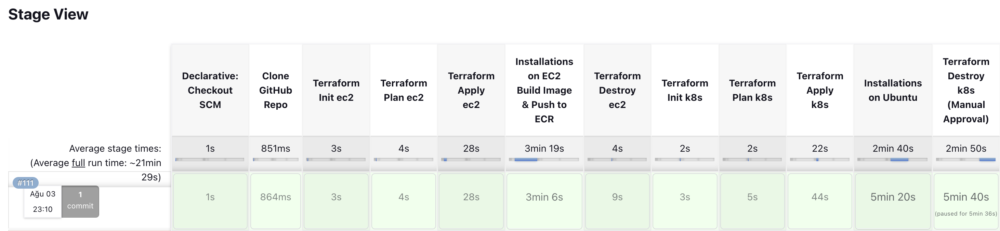

<!-- PROJECT LOGO -->
 

  
  <h1 align="center">Atamert Bilgin Pipeline Website ✨</h1>
  

    It is a personal static website/portfolio built with Terraform, Docker, Kubernetes and AWS, built to showcase my recent projects. Site URL / Demo: 
    <a href="www.atamertbilgin.com">atamertbilgin.com</a>
     
     
    <a href="www.atamertbilgin.com">About Me</a>
  

